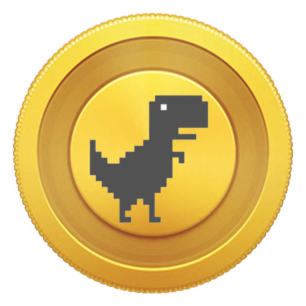
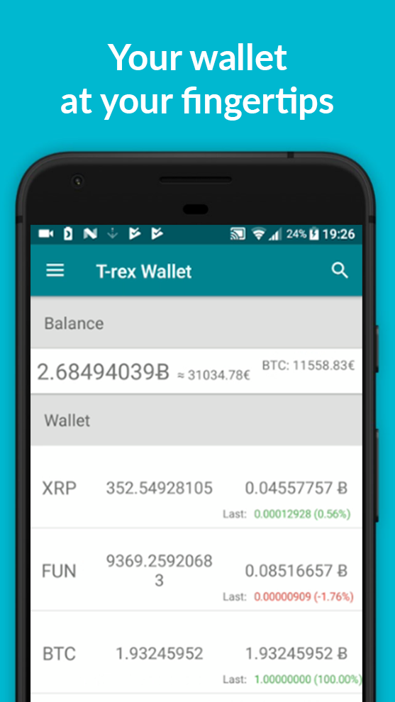
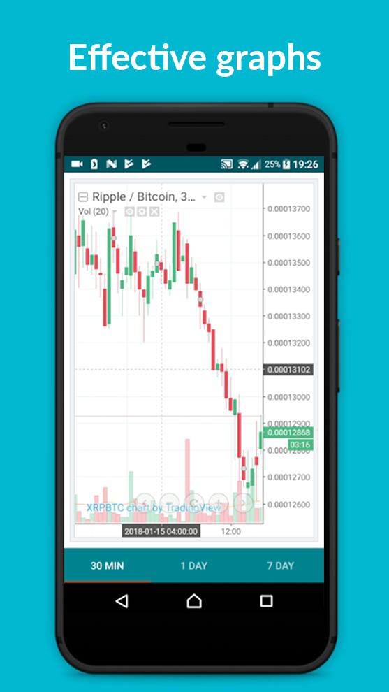
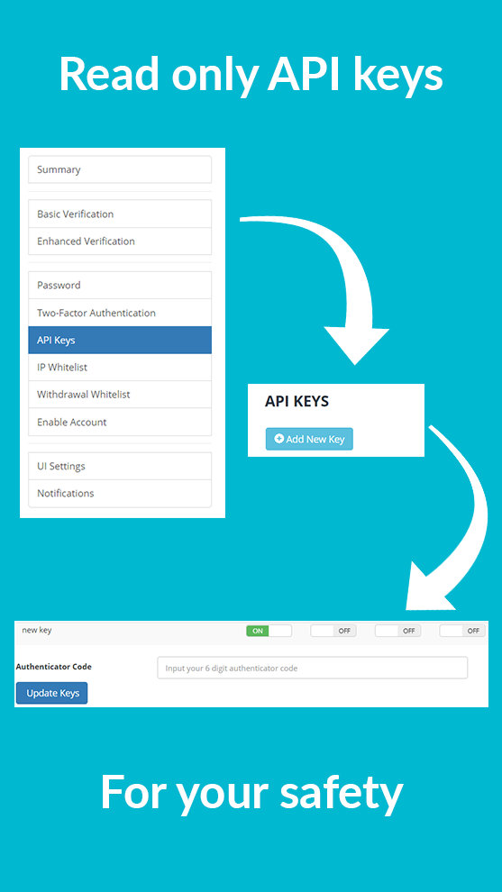

# T-rex Wallet: Mobile Portfolio
Your whole Bittrex cryptocurrency portfolio in one modern mobile wallet.

# Discontinued
App has been discontinued from the play store for lack of interest.

# Description
Check out your Bittrex portfolio anywhere anytime!
Using the Bittrex API you can view your currencies in a modern, easy on the eyes application. 
Check out currencies you plan to buy on the fly in the T-rex market and evaluate every opportunity with the data we provide. 

Disclaimer: 
- This app is not officially affiliated with Bittrex
- This app does not save your data on any servers

# Screenshots

 

# Promo video

https://www.youtube.com/watch?v=qRdjfZ07NB4
<iframe width="560" height="315" src="https://www.youtube.com/embed/qRdjfZ07NB4" frameborder="0" allow="accelerometer; autoplay; encrypted-media; gyroscope; picture-in-picture" allowfullscreen></iframe>
